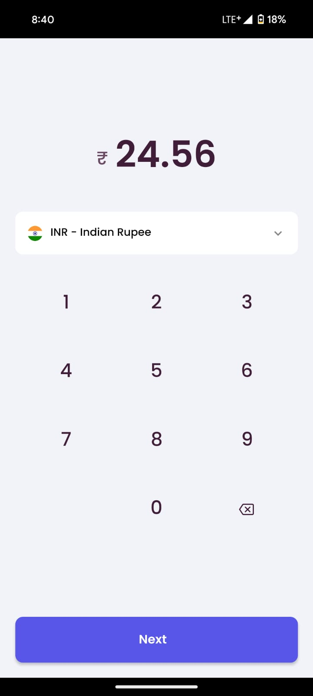
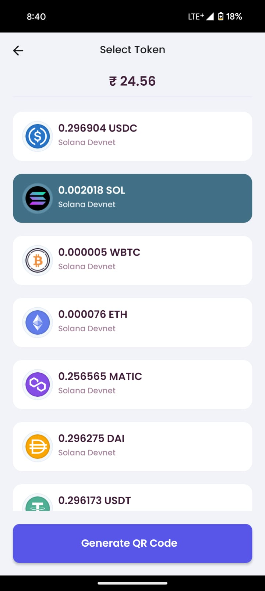
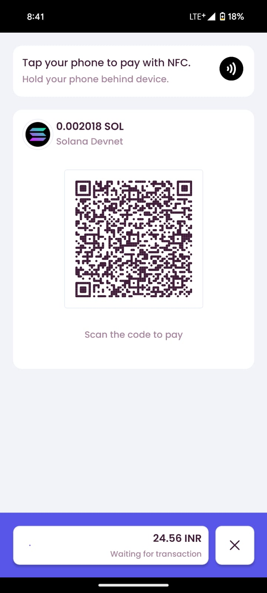
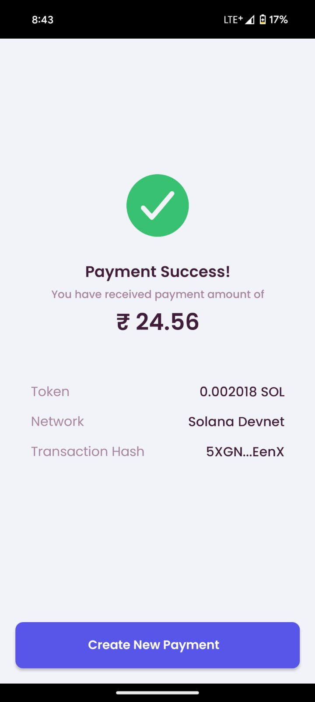

<div id="top"></div>

<br />
<div align="center">
  <h1 align="center">Swiftap</h1>

  <p align="center">
     Simplify cryptocurrency payments with tap-and-pay functionality right from your phone, made with NFC technology.
  </p>
</div>

## Demo

Here is a quick demo of the app.

> [The Twitter Post Link](https://twitter.com/naimish_30/status/1762178541473456145)

## About The Project

<p float="left">
  
  
  
  
</p>

Swiftap is an innovative application that enables cryptocurrency payments with a simple tap of their phone. 
It provides a seamless payment experience for users looking to embrace the future of digital currency.

## Built With

To build this App I used..

- React Native CLI
- [react-native-hce](https://github.com/appidea/react-native-hce)
- [Copperx API](https://copperx.io/)

## Getting Started

step 1 : Clone the repo

```sh
git clone https://github.com/naim30/swiftap.git
```

step 2 : Install libraries

```sh
cd swiftap
npm install
```

step 3 : Start the app

```sh
npm run android
```

## Contact

Naimish Lukhi :
Email - lukhinaimish@gmail.com : [LinkedIn](https://www.linkedin.com/in/lukhi-naimish/) : [Twitter](https://twitter.com/naimish_30)

<p align="right">(<a href="#top">back to top</a>)</p>
